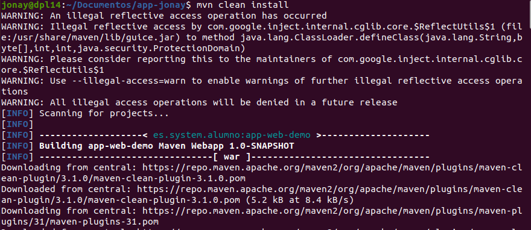

# 1. Despliegue de War en Apache-Tomcat.
En este ejemplo vamos a ver como desplegar y eliminar de una aplicación java en Tomcat.

Para este ejercicios vamos a necesitar tener instalado el jdk de java y MAVEN. Ya con esta herramientas vamos a crear la aplicación web que desplegaremos en Tomcat.

## 1.1 Creación de la aplicación.
Primero de todo vamos a crear del proyecto que vamos a desplegar, para ello vamos a usar maven. Para crear el proyecto vamos a lanzar el siguiente comando:
```
mvn archetype:generate -DgroupId=es.iespuerto.alumno -DartifactId=app-alumno
  -DarchetypeArtifactId=maven-archetype-webapp -DinteractiveMode=false
```

Ahora con el proyecto básico creado vamos a modificar y crear unas serie de ficheros para tener a punto nuestra aplicación.
El primer fichero que vamos a modificar es el “pom.xml” un archivo xml que contiene información sobre el proyecto y los detallas de configuración que utiliza Maven para construir el proyecto. 


El siguiente fichero es el “index.html” que lo encontraremos en “src/main/webapp”  en este fichero realizaremos un hola mundo que se mostrara cuando lancemos nuestra aplicaciones.


En la siguiente carpeta que es “WEB-INF” vemos un un fichero “web.xml” en donde podemos modificar el nombre.


## 1.2 Desplegar aplicación.
Ahora vamos a lanzar la aplicación en Tomcat para ello primero vamos a preparar la aplicación instalando la con maven para ello usamos el siguiente comando.
```
mvn clean install
```

Como se ve en la siguiente imagen.



Ahora veremos que nos aparecerá la carpeta target en donde veremos el war de nuestra aplicación.


Para añadir la aplicación en Tomcat solo tenemos que coger la carpeta “app-web-jonay” y moverla a la ruta “/opt/tomcat/apache-tomcat/webapps/”.


Con esto si accedemos al Tomcat y el nombre de nuestra aplicación para poder verla ya desplegarla.


