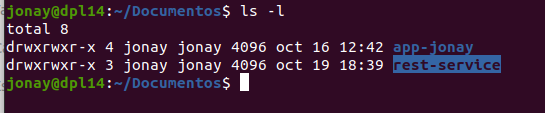
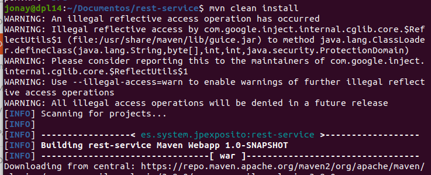
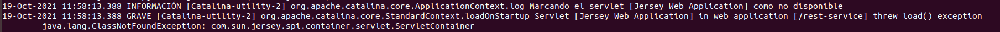
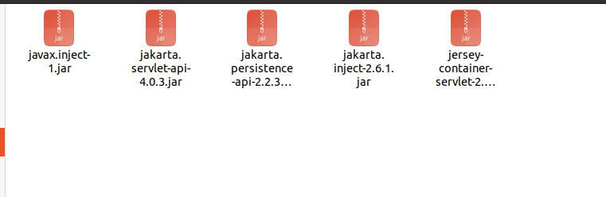

# Despliegue de un servicio REST

## 1. Introducción.
Tenemos la intención de crear nuestro servicio RESTful con nuestra api para ello vamos a implementar
Jersey y por supuesto necesitamos servidor para poder desplegar nuestra aplicación y como en otra
practicas usaremos Tomcat 10.
Esta api aprovechara el Protocolo RFC 2616 y utiliza (GET, PUT, POST, DELET) un CRUD básico por
así decirlo.

## 2. Crear la api REST.
Esta es una api ya creada en Java usan Maven. Solo la descargaremos y la desplegaremos en el Tomcat.

## 3. Despliegue.
Para desplegar la aplicación solo demos usar el comando “mvn clean install” del proyecto maven. Con
esto lo que haremos es hacer nuestro programa ejecutable.

Tras esto debemos mover el archivo war o la carpeta del proyecto, que se nos abran creado en la carpeta tarjet, a la carpeta webapps de nuestro servidor Tomcat10.
Con esto ya tendremos nuestra api REST desplegada en el servidor Tomcat, para acceder a esta debemos
acceder al Tomcat mediante la ip y puerto seguido del nombre de nuestro proyecto “localhost:8083/restservice”

## 4. Problemas al desplegar.
Si nos aparece una problema como el siguiente:

Vemos como en este error nos dice claramente que no puede encontrar la clase ServletContainer para la
biblioteca Jersey. Este error viene dado cuando estamos intentado usar Jersey pero hemos agregado la
dependencia en la classpath.

Lo importante es saber que la linea “java.lang.ClassNotFoundException:
com.sun.jersey.api.container.servlet.ServletContainer” esta basada en Jersey de la versión 1 porque en
jersey de la versión 2 se mueve a otro paquete que es “org.glassfish.jersey” . Viendo esto lo que podemos
a hacer es cambiar el xml para cambiar el paquete a “org.glassfish.jersey”.

Esto debería funcionar siempre y cuando tengamos todas las dependencias en el directorio WEB.INF/lib.

Por lo que para solucionar el problema deberemos cambiar el xml y descargar las librerías en la carpeta ya
dicha.

